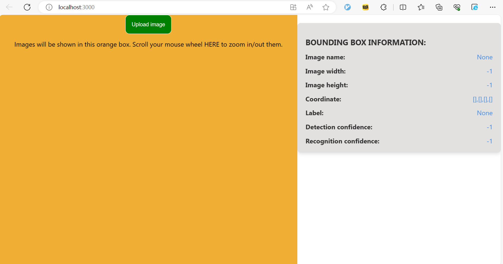
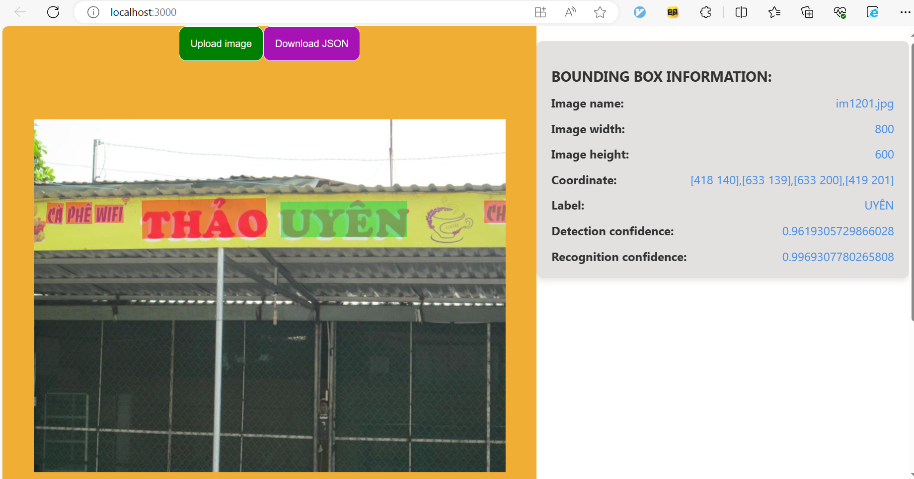
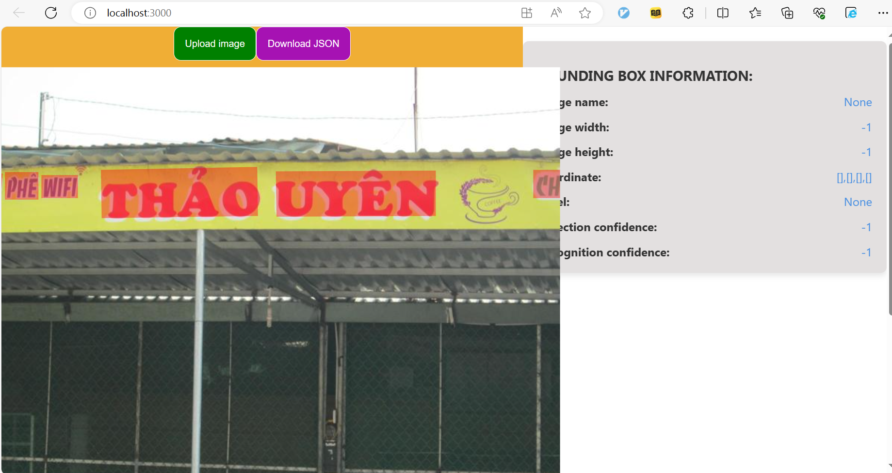

# Hướng dẫn về website demo

## 1. Giao diện 
 
Web sẽ có hai phần chính: bên trái (vùng màu cam) là **Gallery**, bên phải là **Info**.  Để thử nghiệm, người dùng cần ấn nút Upload Image và gửi file `images.zip`, file này chứa các ảnh mà người dùng cần demo.

## 2. Hướng dẫn sử dụng
Đây là giao diện sau khi người dùng gửi file .zip lên hệ thống (để xem thông tin của bounding box, người dùng có thể click vào box tương ứng trên hình):  
  
Nếu người dùng không nhìn rõ chi tiết trong ảnh thì có thể lăn chuột để phóng to:  
  
(#Lưu ý: Người dùng chỉ có thể cuộn trang lên/xuống bằng cách lăn chuột ở phần **Info**, bởi vì sự kiện lăn chuột ở phần **Gallery** được chuyển thảnh phóng to/thu nhỏ ảnh)  
Cuối cùng, nếu người dùng cần kết quả xử lí của toàn bộ ảnh trong file .zip, bấm vào nút Download JSON để tải file .json về máy của mình.

## 3. Cách chạy code
Đầu tiên, host api FastAPI bằng cách chạy file `app.py` ở ngoài , tiếp theo mở một terminal khác và cài các thư viện node_modules, cuối cùng vào thư mục `frontend/str_app/src` chạy app bằng command `npm start`.

